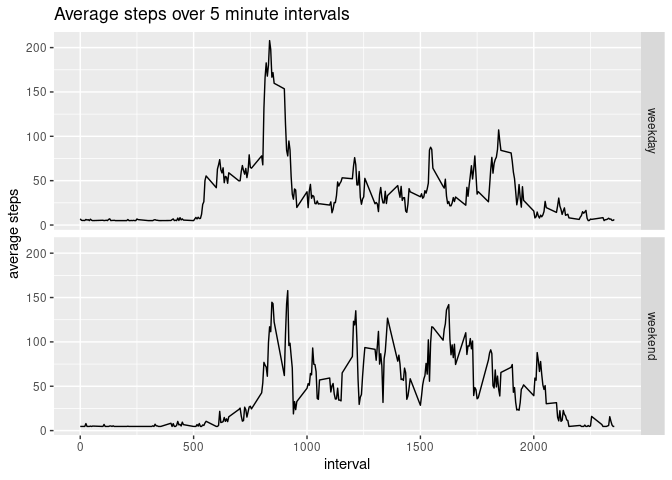

## Loading and preprocessing the data

```r
library(Hmisc)
```

```
## Loading required package: lattice
```

```
## Loading required package: survival
```

```
## Loading required package: Formula
```

```
## Loading required package: ggplot2
```

```
## 
## Attaching package: 'Hmisc'
```

```
## The following objects are masked from 'package:base':
## 
##     format.pval, units
```

```r
library(dplyr)
```

```
## 
## Attaching package: 'dplyr'
```

```
## The following objects are masked from 'package:Hmisc':
## 
##     src, summarize
```

```
## The following objects are masked from 'package:stats':
## 
##     filter, lag
```

```
## The following objects are masked from 'package:base':
## 
##     intersect, setdiff, setequal, union
```

```r
activity <- read.csv("activity.csv")
```

## What is mean total number of steps taken per day?
1.Total steps per day

```r
StepsPerDay <- aggregate(activity$steps, list(activity$date), FUN=sum)
colnames(StepsPerDay) <- c("Date", "Steps")
head(StepsPerDay)
```

```
##         Date Steps
## 1 2012-10-01    NA
## 2 2012-10-02   126
## 3 2012-10-03 11352
## 4 2012-10-04 12116
## 5 2012-10-05 13294
## 6 2012-10-06 15420
```
2. Make a histogram of the total number of steps taken each day


```r
hist(StepsPerDay[,2],main='Steps per Day' ,col='blue',xlab='step')
```

<!-- -->

3.Calculate and report the **mean** and **median** total number of steps taken per day


```r
mean(StepsPerDay[,2],na.rm=TRUE)
```

```
## [1] 10766.19
```

```r
median(StepsPerDay[,2],na.rm=TRUE)
```

```
## [1] 10765
```

## What is the average daily activity pattern?


```r
StepsPerTime <- aggregate(steps~interval,data=activity,FUN=mean,na.action=na.omit)
plot(StepsPerTime,type='l',col='green',main="Average steps per time interval",xlab="Time" ,ylab="Steps")
```

<!-- -->

Which 5-minute interval, on average across all the days in the dataset, contains the maximum number of steps?

```r
ST <- tbl_df(StepsPerTime)
```

```
## Warning: `tbl_df()` is deprecated as of dplyr 1.0.0.
## Please use `tibble::as_tibble()` instead.
## This warning is displayed once every 8 hours.
## Call `lifecycle::last_warnings()` to see where this warning was generated.
```

```r
ST %>% select(interval, steps) %>% filter(steps==max(ST$steps))
```

```
## # A tibble: 1 x 2
##   interval steps
##      <int> <dbl>
## 1      835  206.
```

## Imputing missing values,
1.Calculate and report the total number of missing values in the dataset (i.e. the total number of rows with `NA`s)

```r
length(which(is.na(activity$steps)))
```

```
## [1] 2304
```

2. Devise a strategy for filling in all of the missing values in the dataset. The strategy does not need to be sophisticated. For example, you could use the mean/median for that day, or the mean for that 5-minute interval, etc.


```r
activityImp <- activity
activityImp$steps <- impute(activity$steps, fun=mean)
```
3. Create a new dataset that is equal to the original dataset but with the missing data filled in.

```r
imputed_dataset <- activityImp
head(imputed_dataset)
```

```
##     steps       date interval
## 1 37.3826 2012-10-01        0
## 2 37.3826 2012-10-01        5
## 3 37.3826 2012-10-01       10
## 4 37.3826 2012-10-01       15
## 5 37.3826 2012-10-01       20
## 6 37.3826 2012-10-01       25
```

4.Make a histogram of the total number of steps taken each day and Calculate and report the **mean** and **median** total number of steps taken per day. Do these values differ from the estimates from the first part of the assignment? What is the impact of imputing missing data on the estimates of the total daily number of steps?

```r
impdata <- aggregate(steps ~ date,imputed_dataset,sum, na.rm = TRUE)
hist(impdata$steps, xlab= "Total steps per day",col='blue',main='Mean Imputed dataset')
```

<!-- -->

Mean:

```r
(mean(imputed_dataset[,1]))
```

```
## [1] 37.3826
```
Median:


```r
(median(imputed_dataset[,1]))
```

```
## [1] 0
```

## Are there differences in activity patterns between weekdays and weekends?


```r
imputed_dataset$dateType <-  ifelse(as.POSIXlt(imputed_dataset$date)$wday %in% c(0,6), 'weekend', 'weekday')
head(imputed_dataset)
```

```
##     steps       date interval dateType
## 1 37.3826 2012-10-01        0  weekday
## 2 37.3826 2012-10-01        5  weekday
## 3 37.3826 2012-10-01       10  weekday
## 4 37.3826 2012-10-01       15  weekday
## 5 37.3826 2012-10-01       20  weekday
## 6 37.3826 2012-10-01       25  weekday
```

```r
imputed_dataset$daytype <- factor(imputed_dataset$dateType, levels=c("weekday","weekend"))
newintervalmean <- aggregate(x=list(mean=imputed_dataset$steps), 
                          by=list(interval=imputed_dataset$interval, dateType=imputed_dataset$dateType), 
                          FUN=mean, 
                          na.rm=TRUE)
ggplot(newintervalmean, aes(interval,mean))+geom_line()+facet_grid(newintervalmean$dateType~.)+
  labs(y="average steps", title="Average steps over 5 minute intervals")
```

<!-- -->


